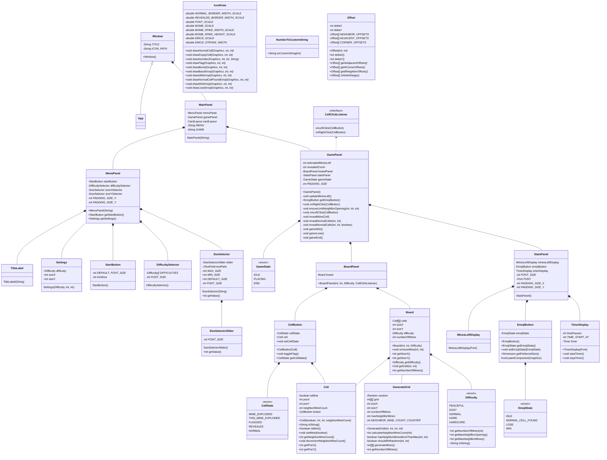

```mermaid
classDiagram
    class App
    Window <|-- App

    class Window {
        -String TITLE*
        -String ICON_PATH*
        +Window()
    }

    class MainPanel {
        -MenuPanel menuPanel
        -GamePanel gamePanel
        -CardLayout cardLayout
        -String MENU*
        -String GAME*
        MainPanel(String)
    }
    Window *-- MainPanel

    class MenuPanel {
        -StartButton startButton
        -DifficultySelector difficultySelector
        -SizeSelector sizeXSelector
        -SizeSelector sizeYSelector
        -int PADDING_SIZE_X*
        -int PADDING_SIZE_Y*
        +MenuPanel(String)
        +StartButton getStartButton()
        +Settings getSettings()
    }
    MainPanel *-- MenuPanel
    
    class TitleLabel {
        TitleLabel(String)
    }
    MenuPanel *-- TitleLabel

    class Settings {
        +Difficulty difficulty
        +int sizeX
        +int sizeY
        Settings(Difficulty, int, int)
    }
    MenuPanel -- Settings

    class StartButton {
        -int DEFAULT_FONT_SIZE*
        -int fontSize
        StartButton()
    }
    MenuPanel *-- StartButton

    class DifficultySelector {
        -Difficulty[] DIFFICULTIES*
        -int FONT_SIZE*
        DifficultySelector()
    }
    MenuPanel *-- DifficultySelector

    class SizeSelector {
        -SizeSelectorSlider slider
        -JTextField textField
        +int MAX_SIZE*
        +int MIN_SIZE*
        +int DEFAULT_SIZE*
        -int FONT_SIZE*
        SizeSelector(String)
        +int getValue()
    }
    MenuPanel *-- SizeSelector

    class SizeSelectorSlider {
        -int FONT_SIZE*
        SizeSelectorSlider()
        +int getValue()
    }
    SizeSelector *-- SizeSelectorSlider
    
    class GamePanel {
        -int estimatedMinesLeft
        -int revealedCount
        -BoardPanel boardPanel
        -StatsPanel statsPanel
        -GameState gameState
        -int PADDING_SIZE*
        +GamePanel()
        -void updateMinesLeft()
        +EmojiButton getEmojiButton()
        +void onRightClick(CellButton)
        -void ensureLimitNeighBorOpening(int, int, int)
        +void onLeftClick(CellButton)
        -void revealMine(Cell)
        -void revealNormalCells(int, int)
        -void revealNormalCells(int, int, boolean)
        -void gameWin()
        -void gameLose()
        -void gameEnd()
    }
    MainPanel *-- GamePanel

    class CellClickListener {
        <<interface>>
        onLeftClick(CellButton)
        onRightClick(CellButton)
    }
    CellClickListener <.. GamePanel

    class GameState {
        <<enum>>
        IDLE
        PLAYING
        END
    }
    GamePanel *-- GameState

    class BoardPanel {
        Board board
        +BoardPanel(int, int, Difficulty, CellClickListener)
    }
    GamePanel *-- BoardPanel

    class CellButton {
        +CellButton(Cell)
        -CellState cellState
        +Cell cell
        +void toggleFlag()
        +CellState getCellState()
        +void setCellState
    }
    BoardPanel *-- CellButton

    class CellState {
        <<enum>>
        MINE_EXPLODED
        THIS_MINE_EXPLODED
        FLAGGED
        REVEALED
        NORMAL
    }
    CellButton *-- CellState

    class Board {
        -Cell[][] cells
        -int sizeX
        -int sizeY
        -Difficulty difficulty
        -int numberOfMines
        +Board(int, int, Difficulty)
        +void removeMine(int, int)
        +int getSizeX()
        +int getSizeY()
        +Difficulty getDifficulty()
        +Cell getCell(int, int)
        +int getNumberOfMines()
    }
    BoardPanel *-- Board

    class Cell {
        -boolean isMine
        -int posX
        -int posY
        -int neighborMineCount
        -CellButton button
        +Cell(boolean, int, int, neighborMineCount)
        +String toString()
        +boolean isMine()
        +void setMine(boolean)
        +int getNeighborMineCount()
        +void decrementNeighborMineCount()
        +int getPosX()
        +int getPosY()
    }
    Board *-- Cell
    CellButton *-- Cell

    class GenerateGrid {
        -Random random*
        -int[][] grid
        -int sizeX
        -int sizeY
        -int numberOfMines
        -int maxNeighBorMines
        -int NEIGHBOR_MINE_COUNT_COUNTER*
        +GenerateGrid(int, int, int, int)
        +int calculateNeighborMineCount(int)*
        -boolean hasNeighborMinesMoreThanMax(int, int)
        -boolean shouldReRandom(int, int)
        +int[][] generateMines()
        +int getNumberOfMines()
    }
    Board -- GenerateGrid

    class Difficulty {
        <<enum>>
        PEACEFUL
        EASY
        NORMAL
        HARD
        HARDCORE
        +int getNumberOfMines(int)
        +int getMaxNeighBorOpening()
        +int getMaxNeighBorMines()
        +String toString()
    }
    Board *-- Difficulty

    class StatsPanel {
        MinesLeftDisplay minesLeftDisplay
        EmojiButton emojiButton
        TimerDisplay timerDisplay
        -int FONT_SIZE*
        -Font FONT*
        -int PADDING_SIZE_X*
        -int PADDING_SIZE_Y*
        StatsPanel()
    }
    GamePanel *-- StatsPanel

    class MinesLeftDisplay {
        MinesLeftDisplay(Font)
    }
    StatsPanel *-- MinesLeftDisplay

    class EmojiButton {
        +EmojiButton()
        -EmojiState emojiState
        +EmojiState getEmojiState()
        +void setEmojiState(EmojiState)
        +Dimension getPreferredSize()
        #void paintComponent(Graphics)
    }
    StatsPanel *-- EmojiButton

    class EmojiState {
        <<enum>>
        IDLE
        NORMAL_CELL_FOUND
        LOSE
        WIN
    }
    EmojiButton *-- EmojiState

    class TimerDisplay {
        -int timePassed 
        -int TIME_START_AT*
        -Timer timer
        +TimerDisplay(Font)
        +void startTimer()
        +void stopTimer()
    }
    StatsPanel *-- TimerDisplay

    class IconDraw {
        -double NORMAL_BORDER_WIDTH_SCALE*
        -double REVEALED_BORDER_WIDTH_SCALE*
        -double FONT_SCALE*
        -double BOMB_SCALE*
        -double BOMB_SPIKE_WIDTH_SCALE*
        -double BOMB_SPIKE_HEIGHT_SCALE*
        -double EMOJI_SCALE*
        -double EMOJI_STROKE_WIDTH*
        +void drawNormalCell(Graphics, int, int)*
        +void drawEmptyCell(Graphics, int, int)*
        +void drawNumber(Graphics, int, int, String)*
        +void drawFlag(Graphics, int, int)*
        +void drawBomb(Graphics, int, int)*
        +void drawBaseEmoji(Graphics, int, int)*
        +void drawIdleEmoji(Graphics, int, int)*
        +void drawNormalCellFoundEmoji(Graphics, int, int)*
        +void drawWinEmoji(Graphics, int, int)*
        +void drawLoseEmoji(Graphics, int, int)*
    }

    class NumberToCustomString {
        +String toCustomString(int)*
    }

    class Offset {
        -int deltaX
        -int deltaY
        -Offset[] NEIGHBOR_OFFSETS*
        -Offset[] ADJACENT_OFFSETS*
        -Offset[] CORNER_OFFSETS*
        +Offset(int, int)
        +int deltaX()
        +int deltaY()
        +Offset[] get4AdjacentOffsets()*
        +Offset[] get4CornerOffsets()*
        +Offset[] get8NeighborOffsets()*
        +Offset[] isNotInRange()*
    }
```